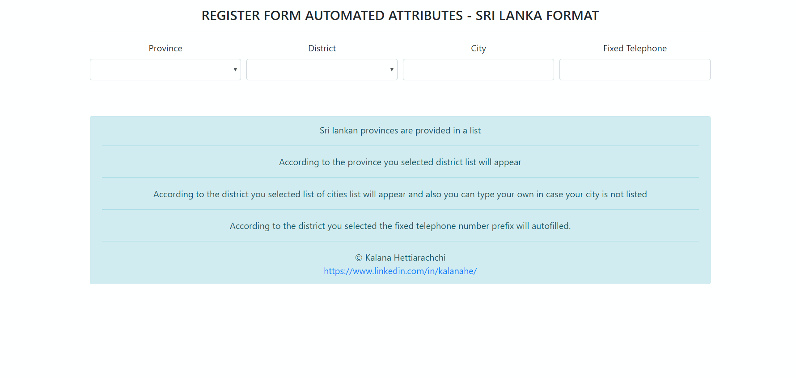

# USEFUL REGISTER FORM AUTOMATED ATTRIBUTES - SRI LANKA FORMAT 

An automated and useful form attributes (Province, District, City, Fixed Telephone) selecting web form for common Sri Lankan Web applications.

  

## How this works?

```html
-Sri Lankan provinces are provided in a list
-According to the province you selected districts list will appear
-According to the district you selected list of cities list will appear and also you can type your own in case your city is not listed
-According to the district you selected the fixed telephone number prefix will auto-filled.
```

## Contributing
Since I'm a newbie to programming when i created this project The data structure i used is very bad. So the contributions are very welcomed to improve this.

Pull requests are welcome.   


Please make sure to update the tests as appropriate.

## Demo
[Online Demo](http://35.244.50.5/SL_Web_Form_Fields)

## Author
[© Kalana Hettiarachchi](https://www.linkedin.com/in/kalanahe/)
  
  
  
  

